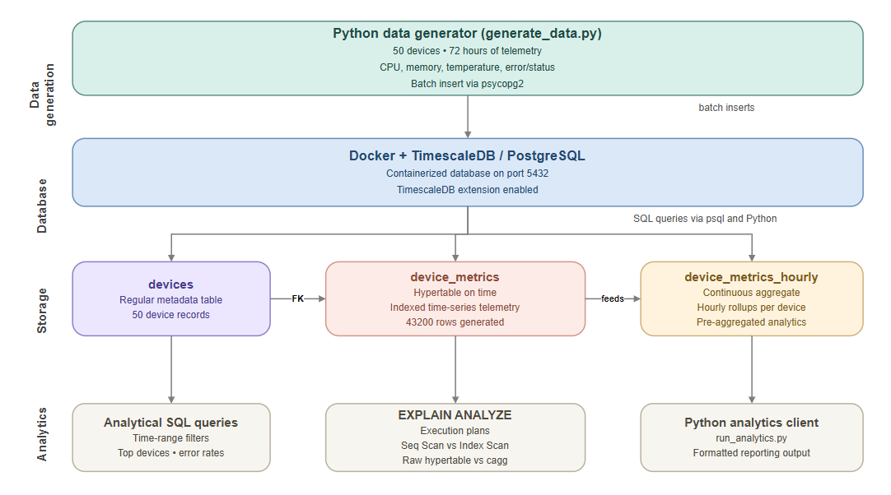

# IoT Timeseries Monitor

A database engineering project built with PostgreSQL and TimescaleDB to simulate real-world device telemetry ingestion and analytics.
This system models a fleet of devices sending CPU, memory, temperature, and status metrics into a time-series database running in Docker. It demonstrates schema design, hypertables, continuous aggregates, indexing, analytical SQL, query-plan analysis with EXPLAIN ANALYZE, transaction integrity, and Python integration with psycopg2.
The goal of this project is to show practical database engineering skills in a production-style setup: storing high-volume time-series data efficiently, querying it with SQL, and analyzing performance using PostgreSQL and TimescaleDB features.

## Architecture



## Stack

- PostgreSQL 16
- TimescaleDB
- Docker / Docker Compose
- Python 3
- psycopg2
- WSL Ubuntu

## What this project demonstrates
### PostgreSQL
- Relational schema design
- Foreign key constraints and data integrity
- SQL joins, aggregates, filtering, sorting, and grouping
- Indexing strategy for time-range and device-based queries
- Query-plan inspection with EXPLAIN ANALYZE
- Transaction behavior and rollback validation

### TimescaleDB
- Hypertable creation with create_hypertable
- Time-series modeling for append-heavy telemetry workloads
- Continuous aggregates using time_bucket
- Faster analytical queries using pre-aggregated hourly rollups
- Performance comparison between raw hypertable queries and continuous aggregates

### System / Integration
- Running PostgreSQL + TimescaleDB locally in Docker
- Interacting with the database using psql
- Python-based ingestion and analytics using psycopg2

## Data model

### devices
Stores metadata for each device, including device name, type, location, and installation timestamp.

### device_metrics
Stores raw telemetry records:
- time
- device_id
- cpu_usage
- memory_usage
- temperature
- error_code
- status

This table is converted into a TimescaleDB hypertable on the 'time' column.

### device_metrics_hourly
A continuous aggregate that stores hourly rollups per device, including average CPU usage, max CPU usage, average temperature, error counts, and sample counts.

## Highlights

- Dockerized TimescaleDB setup for local reproducibility
- Time-series schema built around realistic telemetry data
- Hypertable-based storage for efficient time-range access
- Continuous aggregate for faster hourly analytics
- Indexed SQL queries for common access patterns
- Captured EXPLAIN ANALYZE' output for performance analysis
- Transaction integrity test using foreign key violation and rollback
- Python ingestion and analytics pipeline using 'psycopg2'

## Project structure

```text
iot-timeseries-monitor/
├── analysis/
│   ├── analytics_report.txt
│   └── explain_plans.md
├── docs/
│   └── architecture.jpg
├── scripts/
│   ├── generate_data.py
│   └── run_analytics.py
├── sql/
│   ├── 01_init_extensions.sql
│   ├── 02_schema.sql
│   ├── 03_hypertable.sql
│   ├── 04_continuous_aggregates.sql
│   ├── 05_indexes.sql
│   └── 06_sample_queries.sql
├── docker-compose.yml
├── requirements.txt
└── README.md
```

## Setup
### Start TimescaleDB
docker compose up -d

### Run SQL setup files
docker exec -i timescaledb psql -U tsadmin -d tsdb < sql/01_init_extensions.sql
docker exec -i timescaledb psql -U tsadmin -d tsdb < sql/02_schema.sql
docker exec -i timescaledb psql -U tsadmin -d tsdb < sql/03_hypertable.sql
docker exec -i timescaledb psql -U tsadmin -d tsdb < sql/04_continuous_aggregates.sql
docker exec -i timescaledb psql -U tsadmin -d tsdb < sql/05_indexes.sql

### Create virtual environment and install dependencies
python -m venv .venv
source .venv/bin/activate
pip install -r requirements.txt

### Generate telemetry data
python scripts/generate_data.py

### Run SQL query set
docker exec -i timescaledb psql -U tsadmin -d tsdb -P pager=off < sql/06_sample_queries.sql

### Run Python analytics client
python scripts/run_analytics.py | tee analysis/analytics_report.txt

## Analytical queries included
The project includes queries for:
- recent telemetry for a specific device
- top devices by temperature
- error-rate analysis per device
- hourly rollups from the continuous aggregate
- raw hypertable vs continuous aggregate performance comparison
- transaction integrity validation

## Performance snapshot
The project compares a 7-day hourly aggregation on the raw hypertable with the same workload on the continuous aggregate.
From the captured execution plans:
- raw hypertable aggregation took about **15.6 ms**
- continuous aggregate query took about **1.78 ms**
- the continuous aggregate version was roughly **9x faster**

Detailed plans and observations are documented in 'analysis/explain_plans.md'.

## Python integration
Two scripts are included:
- 'generate_data.py' inserts realistic telemetry data into TimescaleDB
- 'run_analytics.py' executes analytical queries and prints formatted results

This demonstrates how application code can work directly with PostgreSQL and TimescaleDB outside the SQL console.

## Repository outputs

- 'analysis/explain_plans.md' — execution plans and observations
- 'analysis/analytics_report.txt' — output from the Python analytics client

## Summary
This project focuses on the database side of an IoT analytics system: schema design, ingestion, time-series storage, SQL analytics, query optimization, and performance analysis using PostgreSQL and TimescaleDB.
